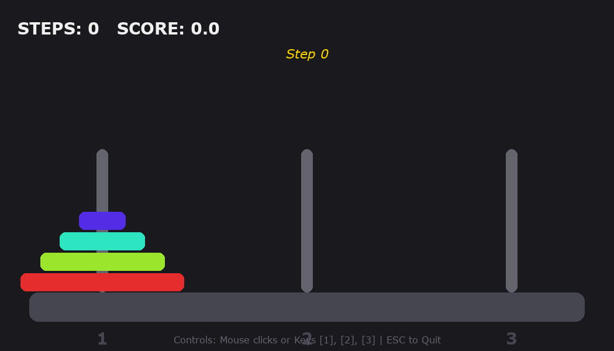
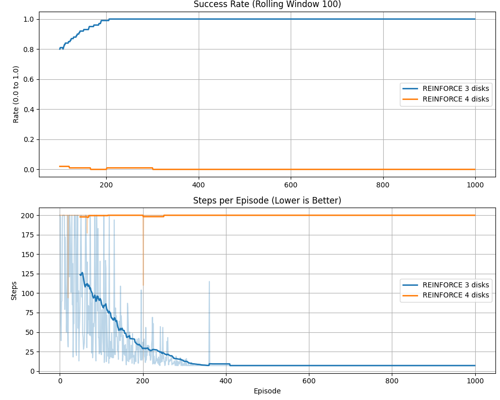
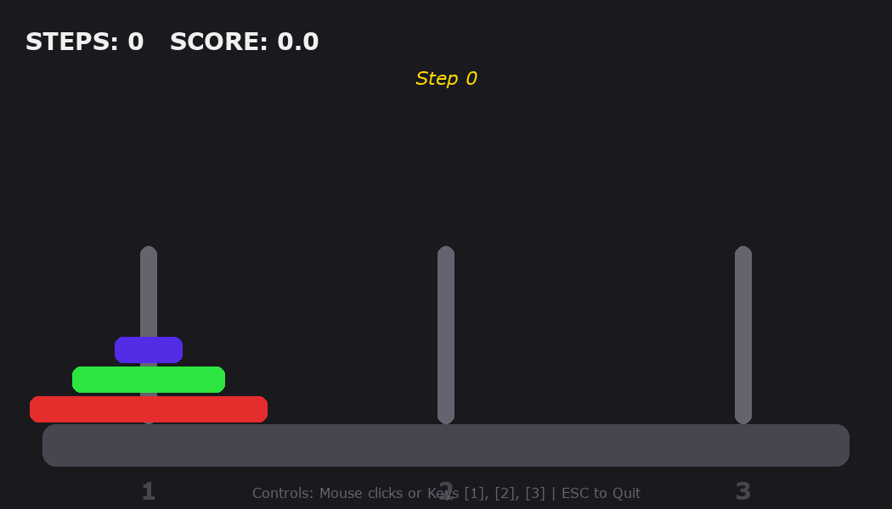
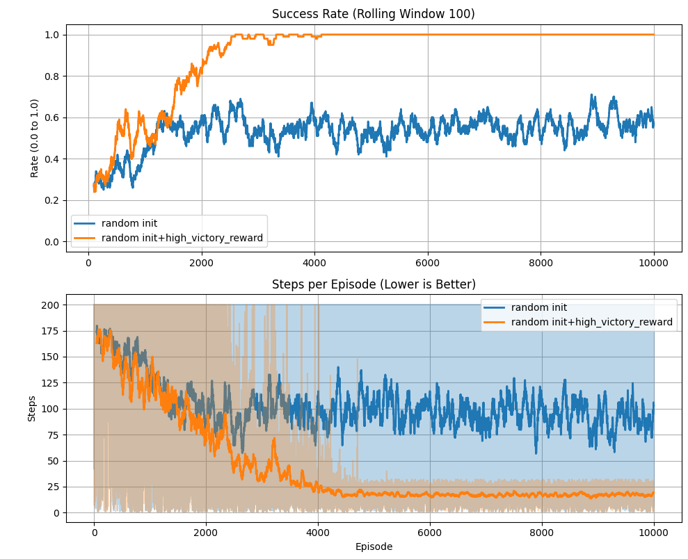
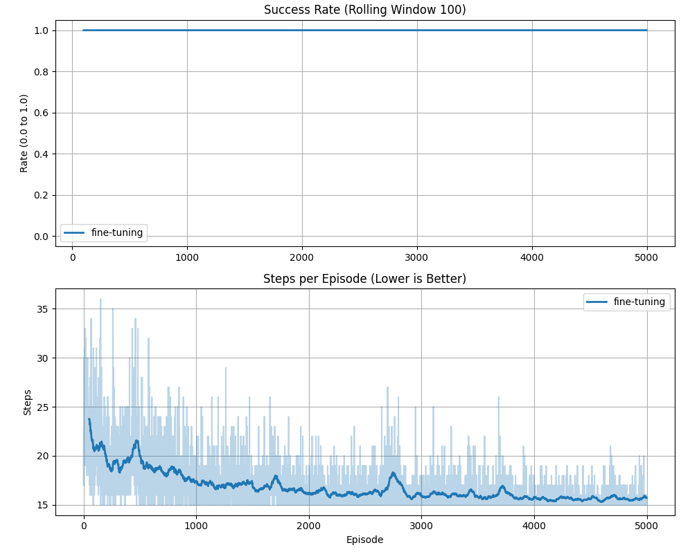

# Towers of Hanoi (REINFORCE vs TRPO)

## Introduction

The goal of the game is to **move all disks from the first peg (stick) to the last peg** while following the main rule of the Tower of Hanoi puzzle:

> A larger disk can never be placed on top of a smaller disk.

At every step, the agent selects a move that transfers the top disk from one peg to another.  
The episode ends when the puzzle is solved or when the maximum number of steps is reached.

  

---

## 1) Game Formulation (MDP)

We model the Tower of Hanoi puzzle as a **Markov Decision Process (MDP)**.

### State Space

We will play with 3 pegs. The last peg is the third one.
Let $n$ be the number of disks.  
A state is represented by the vector:
$$
s = (p_1, h_1, \dots, p_n, h_n),
$$
where $p_i$ is the peg index holding disk $i$. Disk indices correspond to sizes: disk $1$ is the smallest, disk $n$ is the largest. $h_i$ is the height of the disk $i$ on its peg $p_i$. $h_i=0$ means that disk $i$ lies on the bottom of the peg $p_i$

### Action Space

An action corresponds to moving the top disk from source peg $i$ to target peg $j$:
$$
a = (i \rightarrow j), \qquad i,j \in \{1,2,3\}, \quad i \neq j.
$$
An action is **valid** only if the moved disk is smaller than the top disk on peg $j$. If a source peg $i$ is empty, no disk moves with this action.

### Transition Function

The transition function is deterministic:
$$
s_{t+1} = T(s_t, a_t).
$$
If $a_t$ is valid, the environment applies the corresponding disk move (or no move if a source peg is empty). If $a_t$ is invalid, the state remains unchanged.

### Reward Function

We use three types of rewards:
- step penalty $r_{\text{step}}$,
- invalid move penalty $r_{\text{invalid}}$,
- victory reward $r_{\text{victory}}$.

In Phase 1 (initial experiments):
$$
r(s,a)=
\begin{cases}
r_{\text{victory}} & \text{if all the disks are correctly place on the third peg},\\
r_{\text{invalid}} & \text{if the move is invalid},\\
r_{\text{step}} & \text{otherwise}.
\end{cases}
$$

In every episode the agent plays till he wins (collects all the disks on the third peg in correct order) or he reaches the maximum number of steps (200).

Here we measure 2 metrics to describe success of a training:
- Success rate: the frequency of an agent to win the game. (The bigger, the better)
- Steps per episode: How many steps an agent made in the episode. (The lower, the better in case of 100% success rate) The optimal number of steps is equal to $2^n-1$.
---

## 2) Training with REINFORCE

We train a stochastic policy $\pi_\theta(a\mid S_t)$ (neural network parameters $\theta$ using the REINFORCE policy gradient method.

### Objective

The goal is to maximize the expected discounted return:
$$
v^{\pi^\theta}(s_{start})=
\mathbb{E}_{\pi_\theta}
\left[
\sum_{t=0}^{\tau-1} \gamma^t R_t | S_0=s_{start}
\right].
$$
where $s_{start}=(0, 0, 0, 1, 0, 2)$

For each episode we collect a trajectory:

$$
(s_0, a_0), (s_1, a_1), ..., (s_\tau, a_\tau)
$$

And make a step to maximize the following loss:

$$
L(\theta) = -\sum_{t=0}^{\tau-1} G_t \log \pi_\theta(a_t|s_t)
$$
where $G_t = \sum_{k=t}^{\tau-1} \gamma^{k-t} r_k$

---

### Initial training configuration

We first trained the agent with:

$$
r_{victory} = +100, \,\, r_{step} = -1, \,\, r_{invalid} = -5
$$

With **three disks**, the agent learned to solve the puzzle successfully. (success rate=100% and n_steps=2^3-1)

However, when we increased the difficulty to **four disks**, the training behaviour changed significantly. (success rate=0% and n_steps=200)

Instead of learning to solve the puzzle, the agent learned a strategy to **make only valid moves**.  
The reason is that the agent **almost never received the reward for winning** by following the initial policy, so he has no insentive to place all the disks on the third peg.

As a result, the agent optimized for survival instead of completing the task.

  
  

---

### Random Initial States

To improve exploration during training, we introduced **random initial states**.

Instead of always starting from the classical Tower of Hanoi configuration, the environment is initialized with a **random valid configuration of disks**.

This modification improves the learning process in several ways:

- the agent encounters **a larger variety of states** early in training
- the probability of starting **closer to the goal state increases**
- the agent receives the **goal reward more often**

As a result, the policy gradient signal becomes stronger and learning leads the agent to better results (success rate in (0.4, 0.65), n_steps in (75, 125)). However, these results are far from optimal.

We also **increased the reward for winning**, which further strengthens the learning signal. Overall, with random inisialisation of starting state and higher reward for winning the agent managed to train almost perfectly (success rate is equal to 100% and n_steps is around 22).  

---

### Fine-tuning for the Standard Initial State

Even though the agent trained almost perfectly to play the game from a random starting state, it needs to be trained additionally only with standard initial state (where all disks are located on the first peg). 

When training with random initial states, the agent rarely encounters the **original starting configuration** of the Tower of Hanoi puzzle.

Therefore we performed an additional **fine-tuning phase**, where every episode starts from the classical initial state.

This allows the agent to specialize its policy for the original puzzle setup.

  
  

---

# Running the Project

Training can be launched using the provided scripts.

Example:

## 3) Training with REINFORCE + Baseline

### Idea

REINFORCE with baseline reduces the variance of the policy gradient estimator without introducing bias.
For any state-dependent function $b(s_t)$ the following identity holds:
$$
\mathbb{E}_{\pi_\theta}\!\left[\nabla_\theta \log \pi_\theta(A_t\mid S_t)\, b(S_t)\right] = 0,
$$
so subtracting $b(S_t)$ from the return leaves the gradient expectation unchanged while reducing its variance (hopefully).

We use the **value function estimate** $\hat{V}(s)$ as the baseline.
The resulting random variable
$$
A_t = G_t - \hat{V}(S_t)
$$
is called the **advantage** and measures how much better the actual return from step $t$ is compared to the expected return from state $s_t$.

So for gradient like in the theory for REINFORCE with the fact that substracting from $G_t$ any function of state $S_t$ random variable $-$ $b(S_t)$ leaves the gradient expectation unchanged:
$$
\nabla_\theta J(\theta)
=
\mathbb{E}
\left[
\sum_{t=0}^{T}
\nabla_\theta \log \pi_\theta(A_t\mid S_t)\, A_t
\right].
$$

### State Encoding

Because disk heights are uniquely determined by peg assignments, the full state
$s = ((p_0, h_0), \dots, (p_{n-1}, h_{n-1}))$ is characterised solely by the peg assignment vector
$(p_0, \ldots, p_{n-1})$ (0-indexed, $p_i \in \{0,1,2\}$).
We map it to a unique integer index via a mixed-radix encoding:
$$
\text{idx}(s) = \sum_{i=0}^{n-1} p_i \cdot P^{i},
$$
where $P = 3$ is the number of pegs.
The total number of distinct states is $P^n = 3^n$.
Inverse (decoding) is obviously can be uptained by iterative division $\text{idx}(s)$ by $P$.

### Value Function Estimation

The baseline $\hat{V}$ is a table of size $P^n$, recomputed from scratch before every gradient step using the **last $N$ episodes** stored in a circular buffer of length $N$ by the following algorithm:

**Algorithm:**

1. Set $V[i] = 0$, $\; c[i] = 0$ for all $i \in \{0, \ldots, P^n - 1\}$.
2. For each trajectory $\tau$ in the history buffer (oldest to newest):
   - For each pair $(s_t,\, G_t)$ in $\tau$:
$$
V[\text{idx}(s_t)]
\;\mathrel{+}=\;
\frac{G_t - V[\text{idx}(s_t)]}{c[\text{idx}(s_t)] + 1},
\newline

c[\text{idx}(s_t)]
\;\mathrel{+}=\; 1.
$$
3. Return $V$.

This is an **incremental mean**: on completion, $V[\text{idx}(s)]$ equals the unweighted average of all Monte Carlo returns $G_t$ collected from state $s$ across the history buffer.

### Reward Design and Training Setup

The reward function, discount factor $\gamma$, policy network architecture, optimizer, entropy regularisation coefficient, and all other hyperparameters are **identical** to those used for the plain REINFORCE agent (Section 2).
The only structural difference is the subtraction of $\hat{V}(s_t)$ from each return realization $g_t$ before computing the policy loss.
